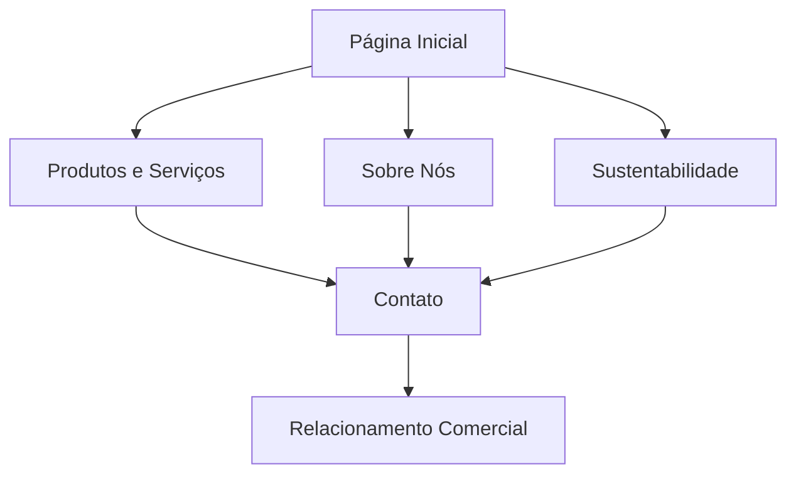

# Documento de Requisitos do Produto - Site Tronco Forte

## 1. Visão Geral do Produto

Site institucional e comercial para a Tronco Forte, madeireira premium especializada em comércio e beneficiamento de madeiras com foco em sustentabilidade e qualidade superior. O site será desenvolvido usando FlightPHP como framework base, com Tailwind CSS, Alpine.js e componentes modernos para criar uma experiência digital profissional que reflita os valores da marca e atenda às necessidades do público B2B.

O objetivo é posicionar a Tronco Forte como referência em sustentabilidade no setor madeireiro, facilitando o relacionamento comercial com construtoras, marcenarias e profissionais da construção civil nas regiões Sul e Sudeste do Brasil.

## 2. Funcionalidades Principais

### 2.1 Papéis de Usuário

| Papel | Método de Acesso | Permissões Principais |
|-------|------------------|----------------------|
| Visitante Padrão | Acesso direto ao site | Navegar por todas as páginas, visualizar produtos, acessar informações de contato |
| Cliente Potencial | Formulários de contato | Solicitar orçamentos, baixar catálogos, agendar visitas |

### 2.2 Módulos de Funcionalidade

Nossos requisitos do site consistem nas seguintes páginas principais:
1. **Página Inicial**: seção hero com carrossel, navegação principal, apresentação dos diferenciais, depoimentos de clientes.
2. **Sobre Nós**: história da empresa, valores, certificações, compromisso com sustentabilidade.
3. **Produtos e Serviços**: catálogo de madeiras, especificações técnicas, certificações FSC.
4. **Sustentabilidade**: práticas ambientais, certificações, rastreabilidade, projetos de reflorestamento.
5. **Contato**: formulário de contato, informações das filiais, mapa de localização.

### 2.3 Detalhes das Páginas

| Nome da Página | Nome do Módulo | Descrição da Funcionalidade |
|----------------|----------------|-----------------------------|
| Página Inicial | Seção Hero | Carrossel com imagens de alta qualidade mostrando produtos e instalações, call-to-action principal |
| Página Inicial | Diferenciais | Cards destacando certificação FSC, rastreabilidade, assessoria técnica e logística própria |
| Página Inicial | Depoimentos | Carrossel com depoimentos de clientes como Ricardo Mendes (persona principal) |
| Sobre Nós | História | Timeline da empresa, marcos importantes, crescimento sustentável |
| Sobre Nós | Valores | Apresentação visual dos 5 valores: sustentabilidade, excelência, confiabilidade, inovação, transparência |
| Produtos e Serviços | Catálogo | Grid responsivo com tipos de madeira, especificações técnicas, certificações |
| Produtos e Serviços | Filtros | Sistema de filtro por tipo, aplicação, certificação e região de origem |
| Sustentabilidade | Certificações | Exibição de selos FSC, práticas ambientais, relatórios de sustentabilidade |
| Sustentabilidade | Rastreabilidade | Explicação do processo de rastreamento da origem das madeiras |
| Contato | Formulário | Campos para nome, empresa, telefone, email, tipo de projeto, mensagem |
| Contato | Localização | Mapa interativo com matriz em SP e filiais, informações de contato |

## 3. Processo Principal

O fluxo principal do usuário começa na página inicial onde o visitante (tipicamente um profissional como Ricardo Mendes) é impactado pelos diferenciais da empresa. Ele navega pelos produtos para avaliar a qualidade e variedade, consulta a seção de sustentabilidade para verificar certificações, e finaliza entrando em contato através do formulário ou telefone para solicitar orçamento e iniciar relacionamento comercial.

## 4. Design da Interface do Usuário

### 4.1 Estilo de Design

- **Cores Primárias**: Marrom Sóbrio (#4A2F20) e Laranja Queimado (#D97925)
- **Cores Secundárias**: Bege Claro (#F2E6DC), Verde Musgo Suave (#6A7F4E), Cinza Escuro Neutro (#2D2D2D)
- **Estilo de Botões**: Arredondados com hover effects, usando cores da marca
- **Tipografia**: Fontes sans-serif modernas, hierarquia clara com tamanhos 16px base, 24px subtítulos, 32px+ títulos
- **Layout**: Design baseado em cards, navegação superior fixa, grid responsivo
- **Ícones**: Lucide Icons via CDN, estilo minimalista e profissional

### 4.2 Visão Geral do Design das Páginas

| Nome da Página | Nome do Módulo | Elementos de UI |
|----------------|----------------|----------------|
| Página Inicial | Seção Hero | Carrossel full-width com GlideJS, overlay de texto, botão CTA laranja queimado, altura 70vh |
| Página Inicial | Diferenciais | Grid 2x2 em mobile, 4x1 em desktop, cards com ícones Lucide, fundo bege claro |
| Produtos e Serviços | Catálogo | Grid responsivo 1-2-3 colunas, cards com imagem, título, especificações, botão "Saiba Mais" |
| Sustentabilidade | Certificações | Layout em duas colunas, imagens dos selos, texto explicativo, cores verde musgo |
| Contato | Formulário | Design limpo, campos com border radius, validação visual, botão de envio destacado |

### 4.3 Responsividade

O produto segue abordagem mobile-first, sendo totalmente responsivo e otimizado para dispositivos móveis. Inclui otimização para touch interaction, lazy loading para imagens below-the-fold, e performance otimizada para conexões mais lentas comuns no público B2B em movimento.

**Créditos**: Desenvolvido por [Essência Marketing e Gestão](https://essenciamarketing.com.br/)